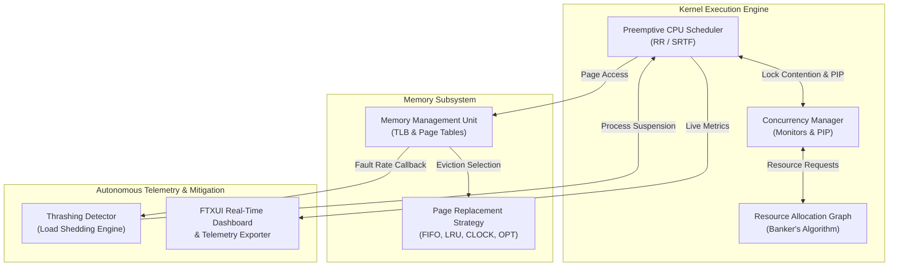

# Antigravity OS Simulator

[](https://en.cppreference.com/w/cpp/20)
[]()
[]()

A high-performance, deterministic C++20 kernel-level Operating System Simulator designed to model concurrent resource management, virtual memory paging hierarchies, preemptive task scheduling, and autonomous thrashing mitigation. Featuring real-time visual telemetry driven by an interactive Terminal User Interface (TUI) and verified through headless formal stress-testing suites.

---

## 1. Executive Summary

Modern operating system kernels must balance strict liveness guarantees with aggressive hardware resource utilization. The **Antigravity OS Simulator** models these foundational kernel dynamics within a unified concurrent engine. 

Built from the ground up in modern C++20, the engine integrates a preemptive multi-core scheduling pipeline with a virtual memory subsystem capable of simulating physical frame exhaustion and dynamic page replacement. To prevent catastrophic concurrent failure modes, the simulator implements formal deadlock avoidance (Banker's Algorithm), transitive priority inheritance protocols (PIP) for priority inversion prevention, and an autonomous load-shedding feedback loop that halts thrashing before liveness is compromised.

---

## 2. Core Architectural Pillars



### I. Preemptive Scheduling & Concurrency Subsystem
* **Multi-Core Dispatch:** Simulates symmetric multiprocessing (SMP) across configurable core topologies using Preemptive Shortest Remaining Time First (SRTF) and Round Robin (RR) algorithms.
* **Transitive Priority Inheritance (PIP):** Resolves priority inversion by dynamically maintaining real-time Wait-For resource allocation graphs. When high-priority processes block on mutexes held by low-priority threads, priority boosts transitively propagate across multi-tiered wait chains.
* **Deadlock Avoidance:** Enforces continuous safety state verification via Dijkstra's Banker's Algorithm prior to granting multi-dimensional resource requests.

### II. Virtual Memory & Paging Subsystem
* **Physical Frame Modeling:** Tracks physical RAM allocation, reference bits, load timestamps, and hardware page flash countdowns.
* **Pluggable Eviction Strategies:** Implements the classic page replacement hierarchy (FIFO, LRU, Clock/Second Chance, and Belady's Optimal Strategy) behind a clean polymorphic interface.
* **Thread-Safe MMU:** Synchronizes concurrent page access and fault handling using reader-writer shared locks (`std::shared_mutex`).

### III. Autonomous Thrashing Mitigation
* **Closed-Loop Telemetry:** The MMU monitors sliding-window page fault frequency. When physical frame saturation forces fault rates above safety thresholds ($\ge 80\%$), an asynchronous pressure event fires.
* **Dynamic Load Shedding:** The `ThrashingDetector` intercepts memory pressure alerts and selectively suspends the process with the highest remaining CPU burst demand, instantly freeing working-set frames and restoring system equilibrium.

---

## 3. Technical Specifications & Design Patterns

The simulator enforces strict adherence to modern software engineering best practices:

* **Monitor Pattern (`ConcurrencyManager`):** Encapsulates all shared synchronization primitives, mutex registries, and Banker allocation tables behind coarse-grained monitor locks (`std::lock_guard<std::mutex>`). This guarantees atomicity across complex multi-step state mutations.
* **Strategy Pattern (`PageReplacementStrategy`):** Decouples page eviction algorithms from core MMU hardware logic, allowing runtime switching of replacement algorithms without kernel recompilation.
* **RAII & Ownership Semantics:** Strictly utilizes `std::unique_ptr` for heap object lifecycles and thread safe atomic primitives (`std::atomic<int>`) for lock-free owner lookups.
* **Polymorphic Callback Architecture:** Leverages decoupled functional injection (`std::function<void(double)>`) to bridge low-level hardware memory faults with high-level kernel scheduling interventions.

---

## 4. Key Performance Features

| Subsystem | Algorithm / Mechanism | Complexity | Theoretical Significance |
| :--- | :--- | :--- | :--- |
| **CPU Scheduling** | Round Robin (RR) | $O(1)$ | Guarantees bounded starvation-free fairness via time-slicing. |
| **CPU Scheduling** | Shortest Remaining Time First (SRTF) | $O(\log n)$ | Minimizes average system waiting time across mixed workloads. |
| **Synchronization** | Transitive Priority Inheritance | $O(d)$ | Prevents unbounded priority inversion across dependency depth $d$. |
| **Resource Safety** | Banker's Algorithm | $O(m \cdot n^2)$ | Guarantees mathematically provable deadlock-free liveness. |
| **Memory Paging** | LRU & Clock (Second Chance) | $O(1)$ | Approximates optimal working-set retention with minimal overhead. |
| **Memory Paging** | Belady's Optimal (OPT) | $O(k)$ | Provides theoretical benchmark upper bound for cache efficiency. |
| **Kernel Resilience** | Dynamic Load Shedding | $O(n)$ | Prevents system liveness collapse under working-set thrashing. |

---

## 5. Getting Started

### Prerequisites
* **C++ Compiler:** Clang 13+, GCC 11+, or MSVC 2022+ (Must support full C++20 standard).
* **Build System:** CMake 3.20+.

### Build Commands

```bash
# Clone the repository
git clone https://github.com/renny6/os-simulator.git
cd os-simulator

# Configure build directory
cmake -B build -DCMAKE_BUILD_TYPE=Release

# Build the main simulation dashboard and test suites
cmake --build build --config Release
```

### Execution & Verification

```bash
# Launch the interactive real-time FTXUI TUI Dashboard
./build/os_simulator

# Execute Headless Formal Verification & Stress Tests
./build/stress_test
./build/priority_test
./build/thrashing_stress_test
```

---

## 6. Challenges Overcome

Building a high-concurrency kernel simulation presents intricate system-level hazards. Key technical victories documented in detail within [CHALLENGES.md](file:///c:/Users/rrenn/OneDrive/Desktop/os%20simulator/CHALLENGES.md) include:

1. **Dual-Vector Heap Corruption during Thrashing:** Solved complex race conditions between asynchronous MMU pressure callbacks and synchronous scheduler ticks by introducing defensive schema bound normalization and atomic monitor synchronization.
2. **Multi-TU Global State Resolution:** Overcame cross-translation-unit linkage failures (`extern g_cm`) across headless verification test harnesses.
3. **Transitive Chain Boosting:** Eliminated recursive priority accumulation anomalies during nested mutex acquisitions.

For a comprehensive breakdown of debugging methodologies, backtrace analyses, and architectural refactoring, consult [CHALLENGES.md](file:///c:/Users/rrenn/OneDrive/Desktop/os%20simulator/CHALLENGES.md).

---

## 7. Recommended Architectural Diagrams

When presenting this portfolio item, the following visual additions are recommended:
* `[Image of TUI Dashboard]`: A screenshot or GIF of the active FTXUI terminal interface illustrating real-time core utilization gauges, memory flash animations, and live Banker matrices.
* `[Image of Thrashing Load Shedding Flow]`: A sequence diagram detailing the exact tick-by-tick message handoff between `MemoryManagementUnit::handle_page_access()`, `ThrashingDetector::on_memory_pressure()`, and `CpuScheduler::suspend_highest_burst_process()`.
